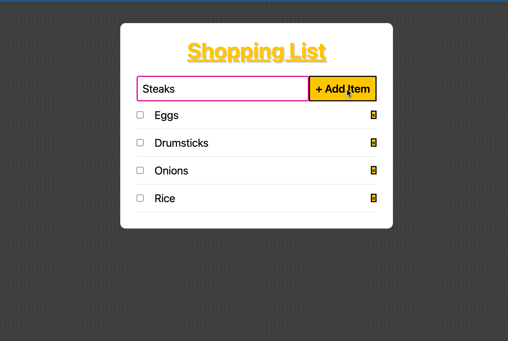
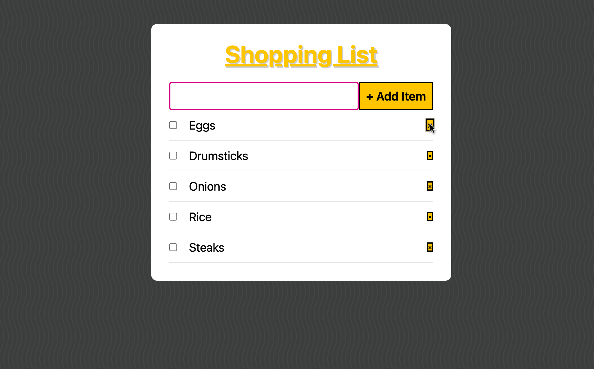
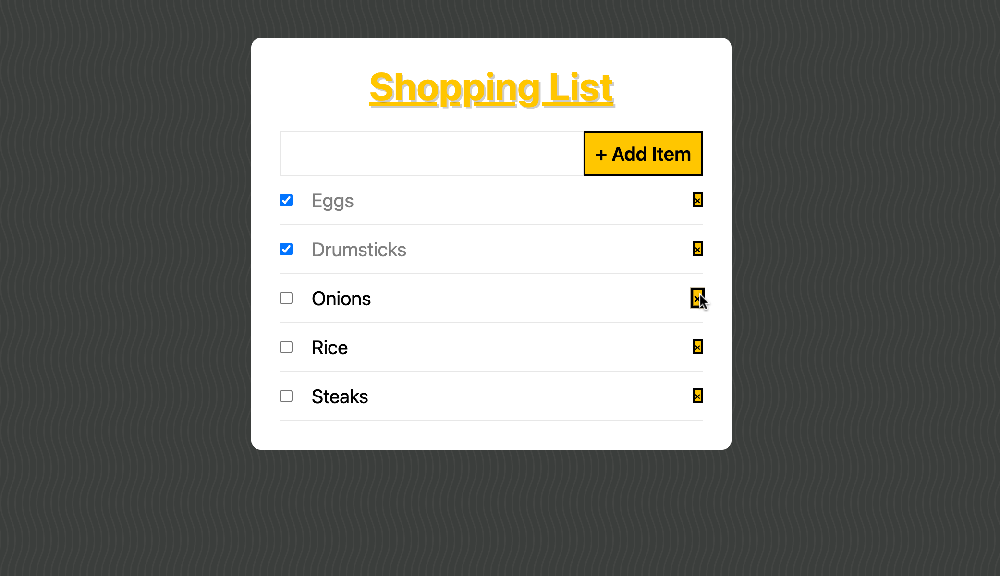

# shopping-list
Shopping List with useful functionalities to keep track of groceries. 
It uses local storage to keep track  and add grocery items to it throughout the week, remove list items, and check them off.
It stores the listed items in local storage until deleted. 

## Steps to get it working

1. Clone Repo/Download files.
2. (Download &)Run npm install on the terminal.
3. Run ```parcel filename.html```
4. Or Open the file on a browser(local).

-------

### Adding Items


### Deleting Items


### Checking off Items

